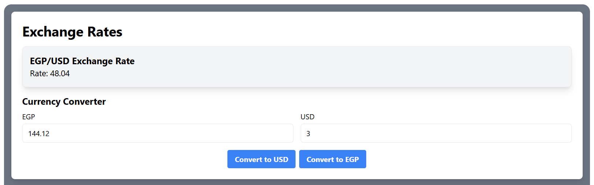
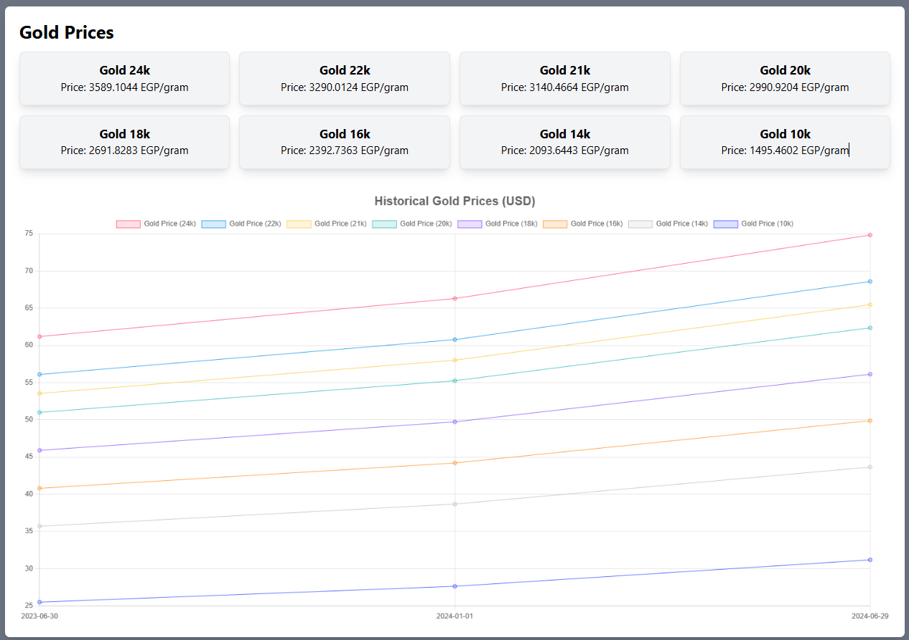

# Project Title

A web app that provides you with the latest news, currency exchange rates for EGP-USD and Gold prices.

Accessible through: https://egypt-updates-app.vercel.app/

## Features

- Retrieves EGP-USD currency exchange rate.
- Provides a currency converter for converting between EGP and USD.
- Displays current gold prices for various carats.
- Visualizes historical gold prices over the last year using a chart.
- Fetches latest news articles from a news API.

## Technologies Used

- ReactJS
- Vite
- Tailwind CSS
- JavaScript (ES6+)

## APIs Used

- **News API**: Used to fetch latest news articles.
- **Exchange Rate API**: Used to fetch current EGP-USD exchange rate.
- **Gold Price API**: Used to fetch current and historical gold prices.

## Setup Instructions

1. Clone the repository.

   ```bash
   git clone https://github.com/your/repository.git
   cd repository-name
   ```

2. Install dependencies.

   ```bash
   npm install
   ```

3. Start the development server.
   ```bash
   npm run dev
   ```

## Components Overview

- **Home**: Main page displaying exchange rates, gold prices, and latest news.
- **CurrencyConverter**: Component for converting between EGP and USD.
- **GoldPricesChart**: Component to visualize historical gold prices.
- **NewsCard**: Component to display individual news articles.
- **ExchangeRateCard**: Component to display current exchange rate.
- **GoldPriceCard**: Component to display current gold prices for different carats.

## Usage

- **Latest News**: Scroll through the latest news articles. Click on an article to view details.
- **Currency Converter**: Enter a value in either EGP or USD field and click "Convert" to see the equivalent amount in the other currency.
- **Gold Prices**: View current gold prices for different carats.
- **Gold Prices Chart**: Analyze historical gold prices with interactive chart.

## Screenshots






